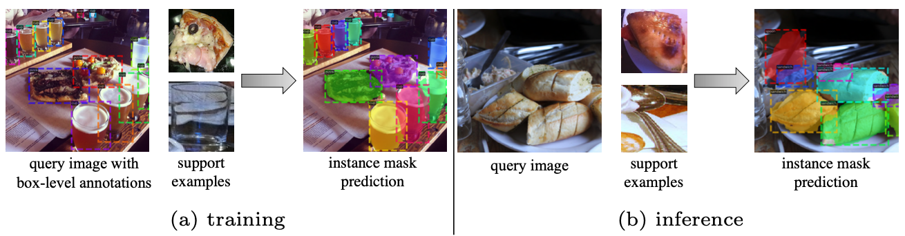

# Mask R-CNN Few-shot Learning

This is repository is the code for a paper I worked before. The code is based on [maskrcnn-benchmark](https://github.com/facebookresearch/maskrcnn-benchmark), and I modify it for few-shot instance segmenation.

- [Paper](https://drive.google.com/file/d/1WHQjgZgnZNr9u7xeFHvc2VnAs_4IoLQj/view?usp=sharing)
- [Supplementary Material](https://drive.google.com/file/d/1M9VnvFiV4_6X1uQSJhmXFStl5Hx_z0Xb/view?usp=sharing)

### [Chinese Version Readme](visualization/work.ipynb)
